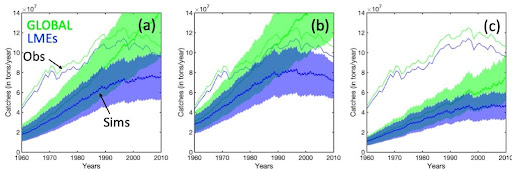
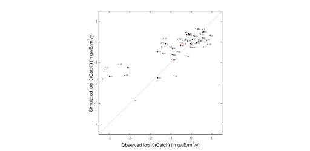

# Model name (IN PROGRESS)
The BiOeconomic mArine Trophic Size-spectrum (BOATS) model.

# Contacts
J. Guiet (jguiet\@atmos.ucla.edu)  
K. Scherrer (kim.jn.scherrer\@gmail.com)  
D. Bianchi (dbianchi\@atmos.ucla.edu)  
E. Galbraith (eric.d.galbraith\@gmail.com  

# Spatial scale forcing
Global, $0.25^{\circ}$ and $1^{\circ}$ model runs

# Levels of gear disaggregation
Summed effort for all gears with no disaggregation for v1.  
Disaggregation between "pelagic" and "demersal" gears for v2 (**list to specify**).  

# Levels of functional group disaggregation
Summed effort for all functional groups with no disaggregation for v1.  
Disaggregation between "pelagic" and "demersal" functional groups for v2 (**list to specify**).  

# Spatial grid-cell allocation method
Total observed nominal effort $E^{t}_{Obs,LME}$ (in W) per LME, for all gears and functional groups, is distributed per grid cell within this LME and per fish size group g (small/medium/large consumers), proportionally to selectable biomass (see following section for definition of selectable biomass):

$$E^t_gds = E^t_{obs,LME} \frac{f^t_{select,g}ds}{\sum_{s/m/l}\sum_{LME}f^t_{select,g}ds}$$

Per unit area ds, with $`f^t_{select,g}`$ the selectable biomass (in $gwB/m^2$), per fish group (g = s/m/l) and per grid cell of this LME. The local effort per fish size group $E^t_{gl}$ (in $W/m^2$) is then used to determine catches and fishing mortality.

# Fishing mortality rate equation

The forced local effort $E^t_g$ (in $W/m^2$) drives harvest Hg (in $gwB/m^2/s$) per grid cell, per fish size group:

$$
H_gds dt = q^tE^t_gf^t_{select,g}ds dt
$$

With $q^t$ the catchability creep parameter (in $m^2/W/s$, see following section). The harvest is imposed as a mortality term in the biomass equation.

# Selectivity (size, age, species)
The consumer biomass available to fishing is modelled for individuals from m = 10g to $10^5g$ as a function of individuals' size. The selectable biomass for fishing is determined by a sigmoidal curve:

```math
f^t_{select,g} = \int^{10^5}_{10} ((1 + (m/m_{\theta,g}))^{c_\sigma/\delta})^{-1} f^t_gdm
```

Where $f^t_g$ (in $gwB/m^2/g$) is the consumer biomass spectrum, $c_{sigma}$ the selectivity slope, $\delta$ a mass to length conversion constant, and $m_{\theta}$ the inflection point of the sigmoidal curve set as respectively $d_g$ = 100/50/25% of the maturation size $m_{\alpha,g}$ for small/medium/large species groups g, modulated by a tuning parameter ${e_m}_{\theta}$ (in \[0.5, 1.5]):

$$ m_{\theta,g} = d_{g}e_{m_\theta}m_{\alpha,g} $$

# Model calibration
For both v1 and v2 BOATS versions, the ecological module that determines the biomass distribution $f^t_g$ was calibrated independently of this round of simulation, in coupled ecological-economical simulations reproducing the historical development of fisheries when forced with climatologies of observed production at low trophic levels (NPP and PFB for v2) and temperature ($T_{75}$ and $T_{bot}$ for v2). 

Parameters of v1 are determined selecting a set of best parameters from an ensemble of 10000 coupled simulations (see Carozza et al. 2017) such that these coupled simulations: (i) match global LME peak harvest (110+/-40 $10^12$ gwB/y); (ii) to have a plausible size structure of catches near simulated peak (i.e. ${H^{glob}}_m > 0.3 {H^{glob}}_s$, $0.8 {H^{glob}}_s > {H^{glob}}_l > 0.1 {H^{glob}}_s$); (iii) to have a plausible catch per unit biomass ratio in LMEs (i.e. $C/B < 0.4 y^{-1}$); (iv) to have an optimum representation of LME peak catches (i.e. selecting best coefficient of determinations of the observed vs simulated LME peak catches). We use the 5 best sets of parameters selected with (i to iv) to parameterize our historical simulations. We present and report the average of these 5 ensembles.

Parameters of v2 are determined (**to complete**)...

The parameterization of v1 and v2 relies on a dynamic development of fishing effort. For the present historical simulations, we adjust the catchability creep parameter $q^t$ (in $m^2/W/s$, see following section) such that forced effective effort ($q^tE^tdt$) at LME peak in the 1990s matches effective effort at peak in the coupled simulations.

# Catchability and creep (yearly rate of change catchability) estimates

In BOATS simulations, exponential catchability increase drives the development of fisheries. This catchability is globally homogenous and set to increases from 5% annually v1 (or 7% for v2):

$$ q^t = q_0 1.05^t$$

where $q_0$ is the catchability at the first year of simulation, here 1840, and *t* the number of years since this reference year.

To impose fishing effort for this round of simulation, we adapted the previously described dynamic simulations (Carozza et al. 2017 and **to complete**) to match simulated effective effort summed over all LMEs at global catch peak in the 1990s $`q_1^{Peak}E^{Peak}_{Sim,LME}`$ with observed effective effort at global peak in LMEs $`q_2^{Peak}E^{Peak}_{Obs,LME}`$. The only tunable parameter is $q_2^{Peak}$, $`E^{Peak}_{obs,LME}`$ is the forcing, and $`q_1^{Peak}E^{Peak}_{Sim,LME}`$ is the emergent effective effort in the dynamic simulation. We determined $q^{Peak}_2$ independently for each set or parameters:

```math
 q^{Peak}_2 = q^{Peak}_1 E^{Peak}_{Sim,LME}/E^{Peak}_{Obs,LME}
```

and then specified independent $q_0$ parameters assuming $q^{Peak}_2 = q^{1995}$. Figure 1 illustrates this tuning with BOATS v1, on a one degree grid. Panel (a) shows the first estimation of $q_0$, panel (b) is a second attempt with fine adjustment of $q_2^{Peak}$ and $q_0$. Note that while we adjust our simulations to match the LME level peak of catches (in blue Fig. 1a,b), global catches (i.e. including high-seas catches) are substantially overestimated (in green Fig. 1a, b). This poor estimation of high-seas catches is corrected with BOATS v2 (**to update**).

Note that following this tuning procedure our simulations overall underestimate the observed catches in LMEs (compare observation with simulation Fig. 1a,b), we suggest that the mismatch of forced effort with productive regions (as opposed to the dynamic simulation where effort develops in most productive regions) leads to an underestimation of fishing yields. Forcing the model with gridded effort, instead of effort aggregated at LME level, further contributes to this mismatch thus amplifying the catch underestimation (compare Fig. 1a and 1c).



Figure 1: Observed and simulated catches. (a) First round of simulation with effort aggregated at LME level and matching observed and simulated effective effort in the 1990s. (b) Second round of simulation with effort aggregated at LME level and fine tuning the catchability to best match LME catch peak. (c) Simulation (a) forced with gridded effort instead of effort aggregated at LME level. In panels a-c, the dotted lines are observations, the plain lines are mean catches from 5 independent simulations with 5 separate optimised parameter sets, and the shaded area the +/-1SD of estimated from the 5 simulations. Panels a-c, in blue the LME level catches and green the global catches. 

# Further details on calibration
For the present calibration procedure, food-web parameters have been estimated with coupled ecological-economical simulations (Carozza et al. 2017 and **to complete**), forced with observed climatologies for NPP and T75. The underestimation of catches in Figure 1 might partly reflect differences in ecological forcing that ultimately result in less productive oceans and thus lower fishing yields.

# Statistical metrics
The metrics for simulation optimization and best parameter selection have been applied on dynamic coupled ecological-economical simulations of BOATS (see section "Model Calibration"). For this round of simulation we adjusted the historical development of catchability such that simulated catches in LMEs reached a maximum in the 1990s, as in observation. This adjustment only affects simulations including fishing.

# Statistical results (summary)
Following are a few additional metrics to assess simulations. They have not been used in the tuning.



Figure 2: Observed vs. simulated variability of LME level catches near global catch peak of the 1990s. For both, simulation forced with obsclim (in red), and simulation forced with ctrlclim (in black), r2 = 0.62. Numbers indicate LMEs as in Carozza et al. 2017.

Global LME peak harvest :  v1, v2 ??

Spatial variability of LME peak catches : v1, v2 ??

???

# Model changes or improvements made as a result of calibration
N/A
