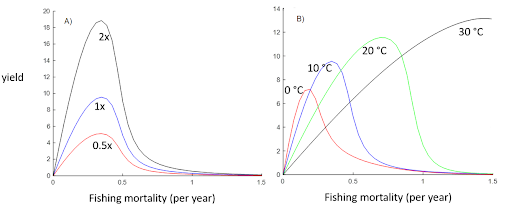

# Model name
FEISTY

# Contacts
Primary contact: Colleen M Petrik [cpetrik\@ucsd.edu](mailto:cpetrik@ucsd.edu)  
Secondary contact: Daniel van Denderen [pdvd\@aqua.dtu.dk](mailto:pdvd@aqua.dtu.dk)  
Other: Ken H. Andersen [kha\@aqua.dtu.dk](mailto:kha@aqua.dtu.dk)  
Other: Charles Stock [charles.stock\@noaa.gov](mailto:charles.stock@noaa.gov)  

# Model ecology overview
MACROECOLOGICAL represents all heterotrophic animal biomass from 1gm – 1 tonne as a static size-spectrum. Total production at any animal body size w is determined by primary production, temperature, the number of trophic levels between the median phytoplankton size and a given animal body size, and trophic transfer efficiency. Total biomass at any given size is determined by total production at that size, divided by the mass-specific production rate (which implicitly includes both somatic growth and respiration), which is a function of temperature and body size.

# Spatial scale forcing
Global $0.25^{\circ}$ and $1^{\circ}$ model runs

# Levels of gear disaggregation
*Which gears are used in the model, how was the effort aggregated or disaggregated?*

We allocated effort according to the functional group (see below) instead of by gear. Artisanal and industrial effort are combined. 

# Levels of functional group disaggregation
*Which functional groups are used in the model, how was effort allocated across groups?*

Forage fish (small pelagic fish), Demersal fish (large demersal fish), Large pelagic fish. 

Effort for each functional group and LME was provided by Fish-MIP.

For catch comparisons, observed catches of demersal, bathydemersal, benthopelagic, flatfish and reef-associated fish were compared with the "demersal fish" functional type in FEISTY. Observed catch data of **pelagic >= 90 cm and 30-90 cm** were compared with the "large pelagic fish" functional type in FEISTY. Catches of pelagic \< 30 cm were compared with the "forage fish" functional type in FEISTY. 

Catch data on sharks, rays, bathypelagic fish and pelagic and benthic invertebrates were not included in the catch comparison. Apart from the invertebrates, all these groups have a minimum contribution to total catch. 

# Spatial grid-cell allocation method
*How was fishing effort allocated across grid-cells? Please provide equations as well as description.*

Effort at the LME level per functional group was used. Effort per LME was spread across all grid cells in proportion to the total gridded effort (artisanal + industrial) on the $0.5^{\circ}$ grid provided by FishMIP.  

We also tested spreading effort per LME across grid cells in proportion to the spatial distribution of pristine simulated biomass. This resulted in higher global catches of all three functional types, which was partly expected based on the way effort is converted into a fishing mortality rate per LME. This method was therefore not used.  

**To check: Effort per LME and functional group could be spread out according to the biomass of each functional group in each LME.**  

# Fishing mortality rate equation
*How are fishing mortality and catch rates calculated in your model? Please provide equations as well as description.*

Effort is converted into a fishing mortality rate using the $F_{MSY}$ for each functional group at each grid cell.  

For all LMEs where effort is relatively high and functional group catch varies over time, we estimated maximum sustainable yield (MSY) per group and LME based on catch information from 1970 to 2004. The estimation of MSY was done using a Schaeffer production model, following [Martell & Froese 2012](https://www.fishbase.de/rfroese/CatchMSY_2.r). We then determined the years that correspond to MSY ($\pm2$ x standard deviation of MSY) and averaged the effort for these years. We divided the effort (E) time series per grid cell (i) and functional type (f) by the mean effort (A) per functional type and LME (r) to obtain a rescaled effort (termed S) time series:

$$ S_{i,r,f,y} = \frac{E_{i,r,f,y}} {A_{r,f}} $$

Years where S=1 indicate that the functional group is fished at $F_{MSY}$.  

In some LMEs or functional group x LME combinations, effort was low and we did not attempt to estimate MSY using the production model. In some other regions, we had difficulties obtaining MSY with the model. For most of these cases, we rescaled the nominal effort time series per LME and functional group using the mean effort values of each functional group from a neighbouring region. A few remaining LMEs and functional groups were rescaled with a mean effort of each functional group based on all other regions. 

We obtained a time series of fishing mortality rates per grid cell, functional group, and LME by multiplying *S* with a fishing mortality rate that corresponds to $F_{MSY}$ in the FEISTY model. For both demersal fish and large pelagics, $F_{MSY-FEISTY}$ is close to 0.3 per year at $10^{\circ}C$ (based on 100% selectivity for adult fish and 10% selectivity for the juvenile class). This value is relatively constant for a range of resource productivities but does vary with temperature (Figure 1). We assumed that part of this temperature effect is contained in the effort values and we therefore set $F_{MSY-FEISTY}$ to 0.3 in all LMEs. 

The $F_{MSY-FEISTY}$ for forage fish is heavily dependent on the amount of predation by demersal fish and large pelagics on forage fish. We were therefore unable to calculate a fishing mortality that corresponds to $F_{MSY-FEISTY}$ for forage fish and assume 0.3 per year.

The final fishing mortality per grid cell i and functional group f  in year y was estimated as:    

```math
F_{i,r,f,y} = 0.3*S_{i,r,f,y}*exp(0.063*(T_i-10)),
```

where T ($^{\circ}C$) is the mean habitat temperature in grid cell *i* (*T* = 0-100m mean for forage fish and large pelagics and *T* = bottom temperature for demersals). The annual fishing mortality rate ($y^{-1}$) is then divided by 365 to produce a daily rate ($d^{-1}$), which is the model time step.



**Figure 1.** Large pelagic fish yield as a function of fishing mortality when medium and large zooplankton resource production (a) or temperature (b) are varied. Medium and large zooplankton are initially set at 80 gram wet weight per $m^2$ per year. No demersal fish are present and forage fish are unfished. 

# Selectivity (size, age, species)
*If you have a selectivity term please describe it, with equation.*

We assume 100% selectivity for adult fish of all 3 functional types (forage, demersal, large pelagic). We apply a 10% selectivity of the forage fish fishing mortality rate on the juvenile class of demersals and large pelagics, to represent bycatch, since they are the same size.

|  |  |
| -------------- | ------------------ |  
| F(medium/adult forage) | = 100% * F_Forage |
| F(medium/juvenile large pelagics) | = 10% * F_Forage |
| F(medium/juvenile demersals) | = 10% * F_Forage |
| F(large/adult large pelagics) | = 100% * F_LgPel |
| F(large/adult demersals) | = 100% * F_Dem |

# Model calibration
*Catchability terms can be used to calibrate the model to catches, using data ONLY UP TO 2004. Please state how you estimate these parameters and the metrics and criteria you use to calibrate your model. Please provide details and equations.*

Simulated catches were compared to observed catches aggregated per functional type at a global scale (based on catch data up to 2004).The simulated catches of demersal and large pelagic fish have a reasonable match with observed catch data, whereas the simulated global catches of forage fish are higher than observed. Simulated catches were further compared to observed catches aggregated per functional type and LME. All areas where the catch in the model was higher than the data were re-calibrated by halving the conversion factor that translates effort to fishing mortality. The reverse was done for all areas where the catch in the data was much higher than the model (under the assumption that fishing mortality was too low and the community is underfished). After model re-calibration, the model was re-run. The model calibration was repeated three times.  

Although model re-calibration improved catch estimates of demersal and large pelagic fish in several LMEs, global results did not justify updating the non-calibrated parameters. We thus used the first, non-calibrated, parameterization for these two functional types in the final run.  

The global and regional estimates of forage fish did improve with model re-calibration. In the final run, we increased the conversion factor that translates effort to fishing mortality in 35 LMEs and reduced the conversion factor in 5 LMEs. At a global scale, the re-calibration reduced simulated forage fish catches and resulted in simulated time series that give a better match with observed forage fish catch data.  

The changes in forage fish fishing mortality had minimal effect on simulated catches of large pelagic and demersal fish. 

# Catchability and creep (yearly rate of change catchability) estimates
*Please provide details on the specific estimated parameters from the calibration, e.g. range of creep of 2-5% per year; and catchability coefficients per gear / functional group as necessary.*

None as of now.

# Further details on calibration
*Have you used other metrics or data in your calibration?*

No.

# Statistical metrics
*Please provide detail on the statistical method used in your calibration - E.g. optimisation, error terms.*

Basic skill metrics like correlation, RMSE, and bias. 

# Statistical results (summary)
*Please provide a summary of the metrics and results associated with your model calibration - E.g. RMSE with observed catches and any other process-based or theoretical criteria used to calibrate the model, comparison of modelled biomass, growth rates, P"B ratios etc.*

Not ready yet.

# Model changes or improvements made as a result of calibration
*Please provide detail of any other parameters or model changes since the last round as a result of this calibration.*

Noticed an issue with size at maturation that will be adjusted in future versions, but not for these simulations.
